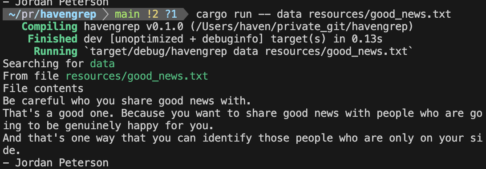

# havengrep

## 20240607

드디어 회사 일을 모두 끝내고 샌드위치 휴일이어서 휴가까지 쓴 금요일에 프로젝트 작업을 착수하였다.

- [havengrep](https://github.com/raacker/havengrep)
- Inspired by [ripgrep](https://github.com/BurntSushi/ripgrep)
- References [Chapter 12 - I/O Command line Projects](https://doc.rust-kr.org/ch12-00-an-io-project.html)

#### std::env에서 프로그램 실행환경 관리 쌉가능

Rust가 최신 언어라는 점은 꽤나 귀찮고 불편한 것들이 자체적으로 구현되어 있다는 점일 듯 싶다. C나 C++만 하더라도 다양한 환경에서 커버 가능하고 쉽게 관리할 수 있는 기능들은 대부분 라이브러리를 통해서만 가능하다. Rust는 언어 자체에서 이를 지원하고 있으니 꽤 편리하다고 볼 수 있는 점.

```rust
fn main() {
    let args: Vec<String> = std::env::args().collect();
}
```

한가지 특이한 점은 으레 main 함수에서 매개변수로 받아야 하는 편인데 (int main(int argc, void\* argv){} 등의 녀석들) rust에서는 이를 다르게 받아서 사용하고 있다.

문서에서는 시를 예제로 들었는데, 나는 최근에 제법 감명깊었던 내용을 파일로 남겨봤다.

> Be careful who you share good news with.
> That's a good one. Because you want to share good news with people who are going to be genuinely happy for you.
> And that's one way that you can identify those people who are only on your side.
>
> \*Jordan Peterson

#### Terminal에 색 입히기

역시 색칠공부가 짱.

ripgrep을 쓰면서도 좋았던 게, 가장 핵심적일 정보들에 visual annotation을 사용해서 한 눈에 바로 알아볼 수 있도록 했다는 점인데, 바로 적용해봤다.

간단하게 [colored](https://docs.rs/colored/latest/colored/index.html)를 cargo로 설치해준 뒤, panic! 메세지와 정상 출력 메세지들에 색을 입혀줬다.

Cargo.toml에는 아래처럼 현재 최신인 2.1.0 버전이 설치된다.

```rust
[dependencies]
colored = "2.1.0"
```

그리고 참 편리하게도 string literal에 바로 적용해줄 수 있다.

```rust
use colored::Colorize;

panic!("{}", "Insufficient arguments".red());
```



